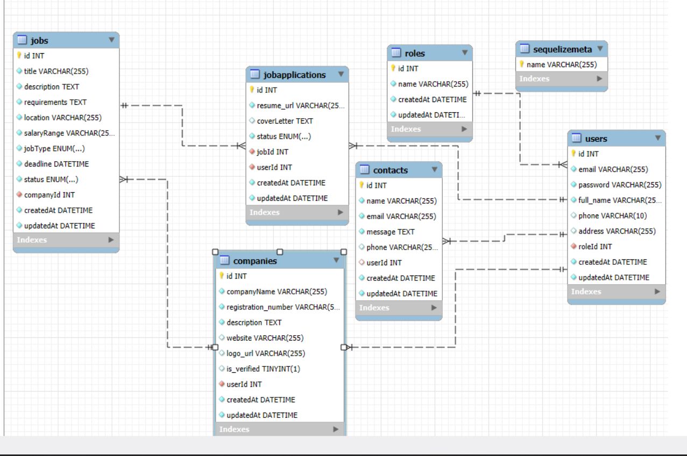

# Elevate Workforce Solutions - Job Portal Web App

Welcome to the **Elevate Workforce Solutions** job portal web application!  
This platform enables companies to manage job postings and track applications in a clean, intuitive interface. It's built with HTML, CSS, and JavaScript on the frontend, and supports API-based interaction with a backend system (e.g., Node.js/Express or PHP with MySQL).

---

## 🌟 Features

- 🔍 View all job listings by the company
- ✏️ Update job statuses dynamically (Open ↔ Closed)
- 🗂 Organized sidebar navigation
- 💻 Responsive and modern UI
- 📡 API integration for real-time job data

---

## 🛠️ Technologies Used

### Frontend
- HTML
- CSS
- JavaScript
- Fetch API
- EJS (Embedded JavaScript templates)

### Backend (Expected)
- Node.js / Express 
- REST API endpoints
- MySQL

---

## 📁 Folder Structure
JobPortal/
│
├── .vscode/             # VSCode-specific settings (optional)
├── config/              # Configuration files (e.g., DB connection)
├── controllers/         # Logic for handling requests
├── databases/           # Database schema or raw SQL (if any)
├── helper/              # Utility/helper functions
├── middleware/          # Custom middleware (e.g., auth checks)
├── migrations/          # Sequelize or DB migration files
├── models/              # Database models (e.g., Job, User)
├── Routes/              # Express routes
├── seeders/             # Data seeding files for database
├── views/               # EJS templates (HTML pages)
│
├── app.js               # Main Express application entry point
├── package.json         # Project metadata and dependencies
└── package-lock.json    # Lockfile for exact dependency versions


---

## 🔧 Setup Instructions

### 1. Clone the Repository

```bash
git clone https://github.com/Dhurel980/job-portal.git
cd job-portal

after cloneing You can use any static server (like Live Server in VS Code):
  npm install
  npm start

for database (in terminal) 
  npx sequelize db:migrate

for refrences database diagram should be this

